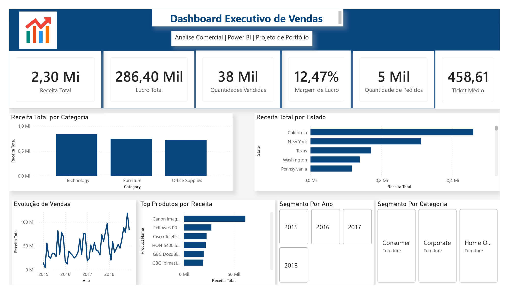

# 📊 Dashboard Executivo de Vendas

## 📌 Objetivo

Este projeto foi desenvolvido em Power BI com o objetivo de transformar dados de vendas em informação estratégicas para apoiar a tomada de decisão.

## 📈 Indicadores

- Receita Total
- Lucro Total
- Margem de Lucro
- Ticket Médio
- Quantidade Vendida
- Quantidade de Pedidos

## 🔧 Ferramentas

- Power BI
- Power Query
- DAX
- Excel

## 📊 Dashboard

> 

## 🔍 Principais Insights

- A categoria **Technology** apresentou a maior receita.
- O estado da **California** concentrou o maior faturamento.
- As vendas apresentaram tendências de crescimento ao longo do período analisado.
- Os KPIs permitem acompanhar rapidamente o desempenho comercial.

## 👨‍💻 Autor

Brendon Oliveira
